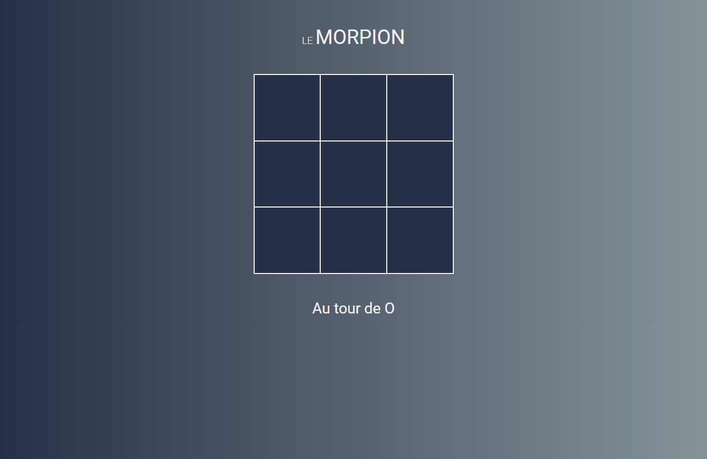
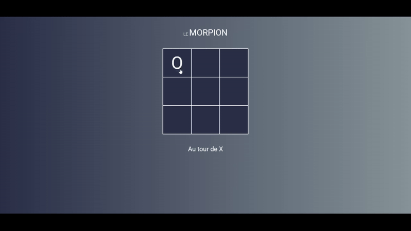

# TIC TAC TOE JS

## Consigne

L'objectif de cet exercice est de reproduire le très célèbre jeu du morpion sans utiliser aucune librairie ni framework.
Il faudra donc être capable de développer une solution en html / CSS / javascript natif.

## Maquette

Voici le résultat attendu :

Vous trouverez la maquette dans le folder `assets/mockup.png`.

**Il ne faut pas que ce soit pixel perfect au niveau du CSS ou les couleurs.**

## Règles du jeu

- Le joueur "O" commmencera toujours en premier
- Le tour de jeu s'alterne entre le joueur "0" et "X" à chaque "move"
- Le premier joueur à avoir aligner 3 marque de manière horizontale, verticale ou diagonale remporte la partie.
- A la fin de la partie il peut y avoir :
  - NUL
  - VICTOIRE
  - DEFAITE
- A la fin de la partie, il faudra afficher un message "Appuyer sur F5 pour relancer la partie"

## Exemple partie complète

